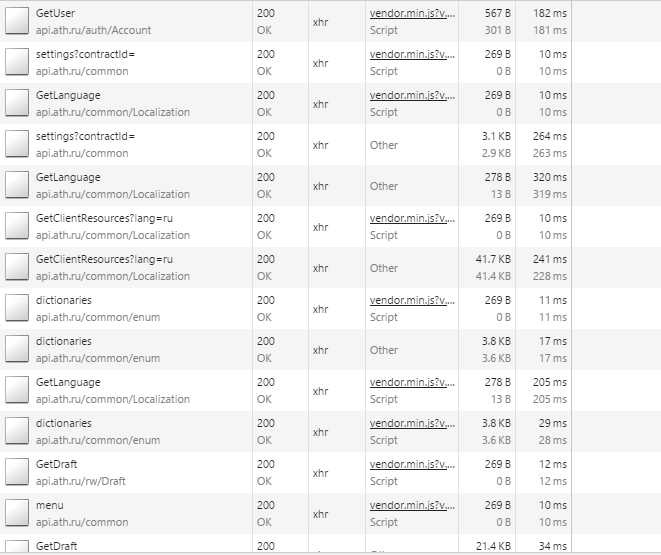

#
#Oглавление
- Результат выполнения домашнего задания

- Быстрый интернет

- Медленный интернет(мобильный)

- Улучшение отзывчивости сайта

- - Загрузка повторного html

- - Загрузка большого объема картинок

- - Загрузка JS

- Полезные инструменты и их результат

- Проверка travel.ath.ru

- Работа веб приложения с хорошим интернетом

- Медленный интернет

- Способы повысить производительность

- - Улучшение JS

- - Улучшение CSS

- - Улучшение XHR

- - Улучшение images

- - Статика

#

#

# Результат выполнения домашнего задания

##Быстрый интернет

Если данный сайт https://lifehacker.ru/ открывать с интернетом 50мб/сек - тогда проблему с загрузкой контента почти не видно (хотя подозрительно крутится во вкладке лоадер). Результат загрузки на рис. 1.

рис. 1. быстрый интернет

Из вкладки Network видно что все DOM-элементы разметки созданы после 1.69секунды. Что достаточно долго при таком интернете и достаточно мощном компьютере.

Сразу пугает то, что загрузка состовляет 18.2МБ. (размер сопоставим с не плохим приложением и с большой функциональностью).

Так же 400 запросов - тоже не может радовать.

##Медленный интернет(мобильный)

Сайт так же можно открыть и с мобильника, что обычно и делают люди в дороге, когда хотят почитать интересную статью. Но телефон скорей всего будет иметь скорость в дороге 2g или 3g. Если рассмотреть медленный интернет то можно увидеть картину как на рис. 2.

рис.2 медленный интернет

иными словами - долго, DOM-элементы разметки созданы аж через 13.51секунду.

Видно, что проблема с сайтом явно есть, и он может терять на мой взгляд огромное количество своих пользователей.

Выясним, как можно побороться с этой проблемой.

##Улучшение отзывчивости сайта

После первого анализа Network при быстром и медленном интернете, хочется сразу отметить количество запросов и разобраться, как их можно оптимизировать.

###Загрузка повторного html

Для getpocket, с сервера [https://lifehacker.ru/pocket/](https://lifehacker.ru/pocket/) - загружается достаточно много повторного html.

рис 3 вид preview загруженного html.

рис 4.часть количества загруженного html для getpocket.

т.к. разметка одинаковая, а разные только данные url, count, и другие поля, то вполне допустим вариант загрузки 1 раз разметки и 1 раз загрузки массива похожих объектов, с разными данными.

###Загрузка большого объема картинок

 Большой объем картинок приводит к заметному ухудшению отзывчивости. Но так как сайт такого формата не может обходиться без них, то следует как минимум оптимизировать следующие моменты.

Уменьшить размер изображения (ширину и высоту) и после сжать его для отображения на странице, без потери качества(например плагином для gulp - &quot;gulp-imagemin&quot;)

###Загрузка JS

 Есть моменты кода, которые представлены на рис 5, нуждающиеся в чистке, а именно удаление комментариев, пробелов, переносов строк.

рис 5 не минифицированный код.

Существуют также и действиетльо большие файлы с js кодом. рис 6

рис.6 длинный файл не минифицированный

Поэтому многие файлы .js - следует минифицировать и удалить комментарии, для тестовых сред допускается то что файлы буду не минифицированы, но вот для production - стоит подумать о пользователях и отзывчивости.

Открыв не минифицированный фал(рис 7) сразу можно сказать, что присутствует дурной тон дубляции кода. Если особо нет времени(и смысла) разбираться в логике, а просто посмотреть &quot;сверху&quot; на код, можно увидеть дубляцию, более 15 строк.

Следовательно перед выпуском в production не плохо было бы отрефакторить js. Что привело бы уменьшению вероятности ошибки, а так же уменьшению размера файла.

рис.7 дубляция

Загрузка статики. Статика (js, css, image, font) загружается с параметром в Request Headers  - &quot;Cache-Control:no-cache&quot;.

Что гласит о том что файлы не кэшируются, возможно в данном сайте это имеет смысл, так как контент часто меняется. Но есть так называемые core файлы как в css, так и в js, которые можно было бы скомпоновать и кэшировать. Что привело бы к уменьшению количества запросов за статикой, и отзывчивости при повторном заходе на сайт.

##Полезные инструменты и их результат

Если запустить встроенный в Developer Tools - Audits.

То он может подсказать нам типичные проблемы, и инструктаж для решения.

Рассмотрим их:

**Combine external CSS (16)**

**Combine external JavaScript (133)**

Эти 2 блока по сути об одном и том же, объединение файлов для уменьшения количества запросов.

Но на мой взгляд, некоторые файлы, не факт что и можно объединить, так как у нас они забираются со сторонних источников. например - &quot;53 JavaScript resources served from vk.com.&quot;

Следующий блок &quot;**Enable gzip compression (16)**&quot;

Этот блок - действительно можно выполнить включив gzip на сервере, так как большинство файлов забираются с основного домена.

В следующем блоке &quot;**Leverage browser caching (401)**&quot;

Сразу настораживает цифра 401. И хочется сказать что Да! Этот пункт нужно выполнить в полном объеме.

Но к сожалению это не так, и вот почему.

Большинство этих запросов  - картинки, которые на данном сайте скорей свего очень часто меняются. и зайдя в следующий раз(на следующий день), картинки уже будут в большинстве своем не актуальны. И такой огромный объем кэша попросту не нужен.

Кэш нужен для статики, для core файлов которые редко меняются, о чем говорилось выше.

Так же значительный объем в этом блоке состовляет &quot;/pocket&quot; но об этом я тоже говорил выше, и что эту проблему нужно решать не кэшем (хотя 1 фал html с разметкой можно и закэшировать)

Блок &quot; **Minimize cookie size**&quot;.

Этот блок говорит о том, чтобы минимизировать куки.

Но скорей вего, куки нужны для обработки логики, скорей всего важной.

И эту проблему можно решить путем разделения запросов на разные домены, которым нужен coockie и нет. например для js css куки явно не нужны.

Блок &quot;**Parallelize downloads across hostnames (126)**&quot;

По мнению этого блока лучше было бы распараллелить загрузку объектов с разных хостов, увеличив тем самым общую скорость.

Блок &quot; **Optimize the order of styles and scripts**&quot;

Этот блок так же перечисляет файлы css и js. И говорит о том, что были найдены некоторые скрипты которые загружаются до рендеринга  страницы, что снижает скорость загрузки. И для разрешения этой проблемы стоит перенести скрипты в body.

Блок &quot;**Remove unused CSS rules (3319)**&quot;

Этот блок явно говорит о том, что большое количество стилей не используется. И для первоначальной загрузки можно было бы объединить стили которые точно нужны. Что привело бы к значительному уменьшению времени загрузки.

#Проверка travel.ath.ru

Формат данного сайта не является похожим на lifehacker. Это веб приложение предназначено для создания заявок на различные путешествия и командировки, для последующей обработки, а так же другие различные операции с уже сформированными заявками.

##Работа веб приложения с хорошим интернетом

При хорошем интернете приложение загружается и рендерится довольно таки быстро

DOMContentLoader 1.01s конец загрузки 2.50s (рис.8)

рис 8 быстрый интернет

И так как у большинства пользователей этого ресурса интернет выше среднего, то вполне допустимые показатели.

##Медленный интернет

Дела обстоят значительно хуже когда интернет 2g

DOMContentLoader 11.01секунд конец загрузки 16.26секунд(рис 9)

рис 9 медленный интернет

Эти показатели являются низкими, и поэтом следует разобраться как же улучшить результат.

Способы повысить производительность

##Улучшение JS

Как видно из приведенных рисунков, основное время загрузки приходится на файл venrod.min.js который содержит в себе весь набор подключаемых сторонних планигов, фреймворков, библиотек и т.п.

Первое что необходимо сделать это уменьшить размер этого файла, путем переосмысления включаемых в него данных.

Видно, что приложение разбито на модули (common.min.js, general.min.js, home, administration ….), но грузятся все эти модули при старте приложения.

Улучшение состоит в том, чтобы подгружать эти модули как только мы к нему обращаемся (lazy подгрузка) таким образом мы сможем избежать лишних запросов.

Благо есть кэш и при повторной загрузки даже с плохим интернетом мы видим следующие показатели.

Но кэш не стабилен и имеет свойство сбрасываться, поэтому надеяться на него сильно не стоит.

Если обратиться к PageSpeed то можно увидеть следующую рекомендацию по улучшению.

&quot;Отложите синтаксический анализ JavaScript&quot;

&quot;При начальной загрузке страницы выполняется синтаксический анализ кода JavaScript объемом 704.9 КБ. Чтобы ускорить отображение страницы, отложите синтаксический анализ JavaScript.&quot;

Это улучшение действительно нужно сделать путем переосмысления начальной загрузки и подключаемых модулей( о чем говорилось уже выше)

##Улучшение CSS

Загружаемые фалы css(рис 10) необходимо тоже улучшить, в настоящий момоент загрузка практически всего css приходит в файле main.css

Но такой подход как видно, не самый правильный, ибо раз уже используется модульный подход в js, то вполне логично использовать его в css.

Поэтому первое что хочется сделать это явно переосмыслить контент main.css и разбить его на модули, соответственно загружать по мере необходимости(как только используем модуль).

рис 10 загружаемые фалы css

Загружаемый css необходимо сжать что приведет к весомому уменьшению загружаемых данных.

##Улучшение XHR

Так как веб приложение нуждается в данных о зашедшем пользователе и подстройкой контента под него (разная локализация, настройка контролов, и т.п.) то необходимо уделить внимание и запросам к серверу. (рис 11)

рис 11 запрос к серверу xhr

В данный момент мы видим, что запросы отсылаются без использования gzip( о чем говорят и другие средства анализа audit, pagespeed и другие)

Хотя для запроса GetClientResources явно gzip не помешал бы.

Так же если рассмотреть ответ этого запроса, можно увидеть json с загружаемыми ресурсами, которые можно было бы как минимум кэшировать на клиенте, в LocalStorage ибо этот контент не так часто меняется.

так же, можно этот запрос разбить на модули, и загружать ресурсы только те, которые нужны конкретному модулю, что привело бы у снижению количества КБ.

На стороне сервера gzip включается в данному конкретном случае из UI в IIS рис 12.

рис 12 настройка iis

##Улучшение images

Так как данное приложение не нуждается в большом объеме картинок, но тем не менее они есть.

И улучшение может быть в уменьшении объема картинок, так как графика плохо сжимается gzip, стоит уделять вниманию сжатию, при помощи плагина &quot;gulp-imagemin&quot;.

Что приводит к результату как на рисунках.(рис 13 - было и рис 15 - стало)

    

  рис 13. было         

  
  рис 14. стало

Разница в 53kb что довольно таки много.

##Статика

Что так же хочется сказать на счет статичных фалов, специфика проекта заключается в том, что публикации на production не так часто случаются, а пользователи используют данный сервис каждый день.

Для ускорения отдачи статики не плохо было бы скомпоновать core с самой базовой функциональностью, (подключение фреймворка, контролы которые везде используются, модули который используются в других кастомных модулях и т.п.)

И после выделения файлов, организовать сервер для отдачи статики, что привело бы к уменьшению нагрузки, и сэкономило килобайты. Например каждый запрос в header передает coockie (1.5кб), в данном приложении она большая (и действительно нужная). Нужна она только для запросов с серверу за данными, но не за статикой и если посчитать, то около 50кб можно было бы не передавать. Что тоже не мало.

travel.ath.ru - приложение которое используется по несколько раз в день, а может и даже целый рабочий день. Для адекватной работы стоит применить все те правила и рекомендации которые описаны выше, это базовый набор улучшений, но который значительно ускорит приложение.

Конечно можно подумать о том чтобы хранить данные в &quot;localstorage&quot; и  &quot;indexeddb&quot;.

Но для этого нужно сильно быть в контексте и проанализировать данные, ибо недостоверная информация - хуже чем быстрая работа.

Если потратить достаточное количество времени для анализа то можно улучшить значительно производительность. На мой взгляд эта тема очень обширна и какого-то конечного предела нет, ибо продукт развивается и все время появляются каике-то новые вещи, за которыми нужно следить, как они влияют на отзывчивость, и улучшать по мере возможности и помнить о здравом смысле время/качество.
